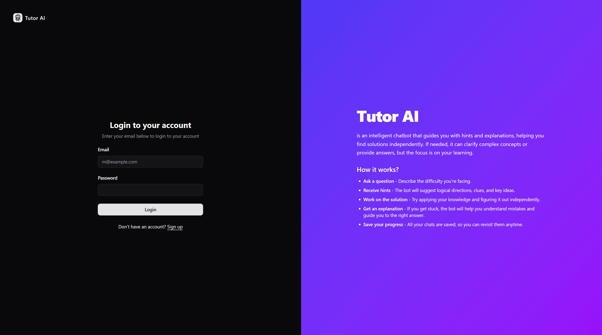

# 👩‍🏫 Tutor AI [Frontend]

A responsive AI tutoring platform interface that allows users to interact with an educational chatbot. The assistant offers step-by-step hints before giving full solutions — designed to encourage learning through guided dialogue. Built with React, TypeScript, and Tailwind CSS.




---

## ⚠️ Important Note

This project requires a running backend server for authentication, routing messages to the OpenAI API, and handling user data.

> 🔗 Backend repository: [tutor-ai-be](https://github.com/dobbyssockk/tutor-ai-be)

> 🐳 Please note: the backend uses a local PostgreSQL database via Docker. You’ll need to set up and run the database container locally when launching the backend.

---

## 🧭 Project Overview

Tutor AI is an intelligent chatbot-based tutoring application. Rather than giving away answers directly, the assistant provides progressive hints to guide users through reasoning and problem-solving. It features authentication, theme toggling, protected routes, and clean modular design.

---

## 🚀 Features

- AI-powered tutoring via GPT (logic-based guidance, not direct answers)
- Auth-protected user flow and session persistence
- Responsive design
- Dynamic routing and component-level architecture
- Accessible and animated UI built with shadcn/ui

---

## 🛠️ Technologies Used

- **React + TypeScript** – robust and typed front-end framework
- **Tailwind CSS** – utility-first CSS styling
- **shadcn/ui** – accessible headless component system
- **React Router** – routing and page structure
- **React Hook Form** – performant form handling
- **Zustand** – lightweight global state management
- **React Query** – server state and API caching
- **Zod** – schema validation
- **OpenAI SDK** – AI chat integration
- **React Markdown** – rendering GPT content as formatted text
- **Sonner** – toast notifications
- **Lucide React** – icon library
- **Vite** – fast development and build tooling

---

## 💡 Key Concepts

- **Prompt engineering**: structured GPT instructions for educational behavior
- **Route guards**: protecting user-only content
- **Server state caching**: handled via React Query for efficient API requests
- **Reusable logic and UI**: shared layouts, inputs, and form behavior
- **Scalable structure**: pages, components, and providers split cleanly

---

## 🧪 Local Installation

```bash
git clone https://github.com/dobbyssockk/tutor-ai-fe.git
cd tutor-ai-fe
npm install
npm run dev
```
